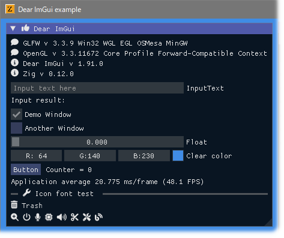
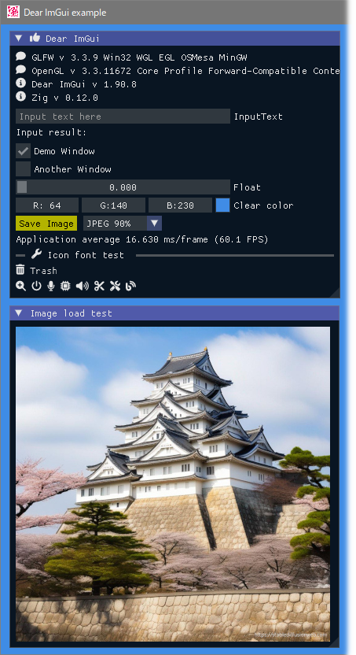

<!-- START doctoc generated TOC please keep comment here to allow auto update -->
<!-- DON'T EDIT THIS SECTION, INSTEAD RE-RUN doctoc TO UPDATE -->

- [ImGuinZ](#imguinz)
  - [Prerequisites](#prerequisites)
  - [Build and run](#build-and-run)
  - [Examples screen shots](#examples-screen-shots)
  - [Hiding console window](#hiding-console-window)
  - [SDL libraries](#sdl-libraries)
  - [My tools version](#my-tools-version)
  - [Similar project](#similar-project)

<!-- END doctoc generated TOC please keep comment here to allow auto update -->

# ImGuinZ

This project aims to simply and easily build **Dear ImGui** examples with **Zig language** using [CImGui](https://github.com/cimgui/cimgui) as first step.

ImGui version **1.90.8** (2024/06)

## Prerequisites

---

- Windows10 OS
- Use **Zig: 0.12.0** (zig cc: clang version 17.0.6)
- **Zig 0.13.0 ?** (Compiling is ok so far)
- MSys/MinGW basic commands (make, rm, cp ...)

## Build and run

---

1. Download this project.

   ```sh
   git clone --recurse-submodules https://github.com/dinau/imguinz
   ```
1. Go to one of the examples folder,

   ```sh
   cd imguinz/examples/zig_glfw_opengl3
   ```

1. Build and Run 

   ```sh
   make run                
   ```

   or 

   ```sh
   zig build --release=fast
   cd zig-out/bin
   zig_glfw_opengl3.exe
   ```

## Examples screen shots 

---

|                                          GLFW |                                          SDL2 |                                          SDL3 |
|:---------------------------------------------:|:---------------------------------------------:|:---------------------------------------------:|
| [zig_glfw_opengl3](examples/zig_glfw_opengl3) | [zig_sdl2_opengl3](examples/zig_sdl2_opengl3) | [zig_sdl3_opengl3](examples/zig_sdl3_opengl3) |





---

|                                        GLFW |
|:-------------------------------------------:|
| [zig_glfw_opengl3_jp](examples/zig_glfw_opengl3_jp) |


---

|                                                                GLFW |
|:-------------------------------------------------------------------:|
| [zig_glfw_opengl3_image_load](examples/zig_glfw_opengl3_image_load) |

  
Image file captured would be saved in current folder.  
Image can be saved as `JPEG / PNG / BMP / TGA` file.

## Hiding console window

---

Open `build.zig` in each example folder and **enable** option line as follows,

  ```zig
  ... snip ...
  exe.subsystem = .Windows;  // Hide console window
  ... snip ...
  ```

  and execute `make`.

## SDL libraries

---

- SDL3  Build-SDL3  
https://github.com/mmozeiko/build-sdl3/releases  
https://github.com/mmozeiko/build-sdl3
- SDL3 Build-SDL3-Win32  
https://github.com/JBetz/build-sdl3-win32/releases  
https://github.com/JBetz/build-sdl3-win32

## My tools version

---

- clang version 18.1.6
- gcc.exe (Rev2, Built by MSYS2 project) 13.2.0
- git version 2.41.0.windows.3
- make: GNU Make 4.3
- Python 3.12.3
- zig: 0.12.0 (zig cc: clang version 17.0.6)
- SDL2 ver.2.30.3
- SDL3 2024-06-02

## Similar project

---

| Language             | Project                                                                                                                                         |
| -------------------: | :----------------------------------------------------------------:                                                                              |
| **Nim**              | [Imguin](https://github.com/dinau/imguin), [Nimgl_test](https://github.com/dinau/nimgl_test), [Nim_implot](https://github.com/dinau/nim_implot) |
| **Lua**              | [LuaJITImGui](https://github.com/dinau/luajitimgui)                                                                                             |
| **Python**           | [DearPyGui for 32bit WindowsOS Binary](https://github.com/dinau/DearPyGui32/tree/win32)                                                         |
| **Zig**, C lang.     | [Dear_Bindings_Build](https://github.com/dinau/dear_bindings_build)                                                                             |
| **Zig**              | [ImGuinZ](https://github.com/dinau/imguinz)                                                                                         |
