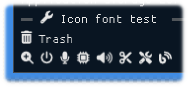

<!-- START doctoc generated TOC please keep comment here to allow auto update -->
<!-- DON'T EDIT THIS SECTION, INSTEAD RE-RUN doctoc TO UPDATE -->

- [ImGuinZ](#imguinz)
  - [Prerequisites](#prerequisites)
  - [Build and run](#build-and-run)
  - [Examples screen shots](#examples-screen-shots)
    - [Image load](#image-load)
    - [Showing CJK multi byte fonts and input UTF-8 text](#showing-cjk-multi-byte-fonts-and-input-utf-8-text)
    - [Icon font viewer](#icon-font-viewer)
    - [Image load / save](#image-load--save)
    - [glfw_opengl3_implot](#glfw_opengl3_implot)
  - [ImPlot Demo written in Zig lang.](#implot-demo-written-in-zig-lang)
    - [Build and run](#build-and-run-1)
    - [ImPlot demo source in Zig lang.](#implot-demo-source-in-zig-lang)
    - [Plots Tab](#plots-tab)
      - [LinePlots (Dynamic)](#lineplots-dynamic)
      - [BarGroups](#bargroups)
      - [BarStacks](#barstacks)
      - [PieCharts](#piecharts)
      - [Heatmaps](#heatmaps)
      - [Histogram2D](#histogram2d)
      - [Images](#images)
    - [Axes Tab](#axes-tab)
      - [LogScale](#logscale)
    - [Subplots Tab](#subplots-tab)
      - [Tables (Dynamic)](#tables-dynamic)
    - [Tools Tab](#tools-tab)
      - [DragRects](#dragrects)
  - [Show / Hide console window](#show--hide-console-window)
  - [SDL libraries](#sdl-libraries)
  - [My tools version](#my-tools-version)
    - [Similar project ImGui / CImGui](#similar-project-imgui--cimgui)
    - [SDL game tutorial Platfromer](#sdl-game-tutorial-platfromer)

<!-- END doctoc generated TOC please keep comment here to allow auto update -->

## ImGuinZ 

  


This project aims to simply and easily build [Dear ImGui](https://github.com/ocornut/imgui) 
[(CImGui)](https://github.com/cimgui/cimgui) / [ImPlot](https://github.com/epezent/implot) [(CImPlot)](https://github.com/cimgui/cimplot) 
examples in Zig language with less external dependencies.

- ImGui / CImGui version **1.91.6dock** (2024/12)
- OS: Windows and Linux
- Frontends and Backends 
    
   |                    | GLFW   | SDL2  | SDL3   |
   | ---                | :----: | :---- | :----: |
   | OpenGL3<br>backend | v      | v     | v      |

- Features 
   - Included [Font Awesome](https://fontawesome.com/search?m=free&o=r) Icon fonts.  
      
   - Included GLFW 3.3.9 static library (for Windows)
   - Included SDL2/SDL3 libraries (for Windows)
   - Included STB libraries (only stb_image) for Load / Save images
   - Available [ImPlot](https://github.com/epezent/implot) [(CImPlot)](https://github.com/cimgui/cimplot) with `ImDrawIdx="unsigned int"`
   - Enabled Input method \(IME\) flag with `IMGUI_ENABLE_WIN32_DEFAULT_IME_FUNCTIONS`


### Prerequisites

---

- Zig version  
   ~~Probably [zig-windows-x86_64-0.14.0-dev.xxxx+yyyy...](https://ziglang.org/download/) might all be OK~~  
   1. Use Zig: 0.14.0-dev.2367+aa7d13846 is OK (2024/12)  
    https://ziglang.org/builds/zig-windows-x86_64-0.14.0-dev.2367+aa7d13846.zip

- WindowsOS
   - Windows10 or later
   - MSys2/MinGW basic commands (make, rm, cp, strip ...)
- Linux OS  
Linux Mint 22 is OK. (or Ubuntu / Debian families ?)

  ```sh
  $ sudo apt install xorg-dev libopengl-dev libgl1-mesa-dev
  ```

  and for glfw3 and sdl2,

  ```sh
  $ sudo apt install libglfw3 libglfw3-dev
  $ sudo apt install libsdl2-dev
  ```

### Build and run

---

1. Download this project.

   ```sh
   git clone --recurse-submodules https://github.com/dinau/imguinz
   ```
1. Go to one of the examples folder,

   ```sh
   cd imguinz/examples/glfw_opengl3
   ```

1. Build and Run 

   ```sh
   make run   # or  zig build --release=fast run
   ```

### Examples screen shots 

#### Image load 

---

Image load and magnifying glass


[glfw_opengl3.zig](https://github.com/dinau/imguinz/raw/main/examples/glfw_opengl3/src/main.zig)  
[sdl2_opengl3.zig](https://github.com/dinau/imguinz/raw/main/examples/sdl2_opengl3/src/main.zig)  
[sdl3_opengl3.zig](https://github.com/dinau/imguinz/raw/main/examples/sdl3_opengl3/src/main.zig)


#### Showing CJK multi byte fonts and input UTF-8 text 

---

[glfw_opengl3_jp.zig](https://github.com/dinau/imguinz/raw/main/examples/glfw_opengl3_jp/src/main.zig)


#### Icon font viewer

---

[iconFontViewer.zig](https://github.com/dinau/imguinz/raw/main/examples/iconFontViewer/src/main.zig) and magnifying glass


#### Image load / save

---

Image load / save and magnifying glass.  
Image file captured would be saved in .the folder `./zig-out/bin`.  
Image can be saved as `JPEG / PNG / BMP / TGA` file.

[glfw_opengl3_image_load.zig](https://github.com/dinau/imguinz/raw/main/examples/glfw_opengl3_image_load/src/main.zig) 

  

#### glfw_opengl3_implot

---

[glfw_opengl3_implot.zig](https://github.com/dinau/imguinz/raw/main/examples/glfw_opengl3_implot/src/main.zig)


### ImPlot Demo written in Zig lang.

---

Now work in progress.


#### Build and run

```sh
pwd
examples/imPlotDemo
make run   # or zig build --release=fast run
```

#### ImPlot demo source in Zig lang.

---

[demoAll.zig](https://github.com/dinau/imguinz/raw/main/examples/imPlotDemo/src/demoAll.zig)

#### Plots Tab

---

##### LinePlots (Dynamic)


##### BarGroups


##### BarStacks


##### PieCharts


##### Heatmaps


##### Histogram2D


##### Images


#### Axes Tab

---

##### LogScale


#### Subplots Tab

---

##### Tables (Dynamic)


#### Tools Tab

---

##### DragRects 


### Show / Hide console window

---

Open `build.zig` in each example folder and   
Hide console window: Default,  
Show console window: Comment out this line as follows,

  ```zig
  ... snip ...
  //exe.subsystem = .Windows;  // Hide console window
  ... snip ...
  ```

  and rebuild example.

### SDL libraries

---

- SDL3  
https://github.com/libsdl-org/SDL/releases

- SDL3  Build-SDL3  
https://github.com/mmozeiko/build-sdl3/releases  
https://github.com/mmozeiko/build-sdl3
- SDL3 Build-SDL3-Win32  
https://github.com/JBetz/build-sdl3-win32/releases  
https://github.com/JBetz/build-sdl3-win32

### My tools version

---

- Windows11 (main)
   - Make: GNU Make 4.4.1
   - SDL2 ver.2.30.8
   - SDL3 3.1.3
   - Git version 2.46.0.windows.1
- Linux Mint 22 (sub)
   - Make: GNU Make 4.3
   - SDL2 ver.2.30.0
   - Git version 2.43.0

#### Similar project ImGui / CImGui

---

| Language             |          | Project                                                                                                                                         |
| -------------------: | :---:    | :----------------------------------------------------------------:                                                                              |
| **Nim**              | Compiler | [ImGuin](https://github.com/dinau/imguin), [Nimgl_test](https://github.com/dinau/nimgl_test), [Nim_implot](https://github.com/dinau/nim_implot) |
| **Lua**              | Script   | [LuaJITImGui](https://github.com/dinau/luajitImGui)                                                                                             |
| **Zig**, C lang.     | Compiler | [Dear_Bindings_Build](https://github.com/dinau/dear_bindings_build)                                                                             |
| **Zig**              | Compiler | [ImGuinZ](https://github.com/dinau/imguinz)                                                                                                     |
| **NeLua**            | Compiler | [NeLuaImGui](https://github.com/dinau/neluaImGui)                                                                                               |
| **Python**           | Script   | [DearPyGui for 32bit WindowsOS Binary](https://github.com/dinau/DearPyGui32/tree/win32)                                                         |

#### SDL game tutorial Platfromer

---


| Language             |          | Project                                                            |
| -------------------: | :---:    | :----------------------------------------------------------------: |
| **Nim**              | Compiler | [Nim-Platformer](https://github.com/dinau/nim-platformer)          |
| **LuaJIT**           | Script   | [LuaJIT-Platformer](https://github.com/dinau/luajit-platformer)    |
| **Nelua**            | Compiler | [NeLua-Platformer](https://github.com/dinau/nelua-platformer)      |
| **Zig**              | Compiler | [Zig-Platformer](https://github.com/dinau/zig-platformer) (WIP)    |
