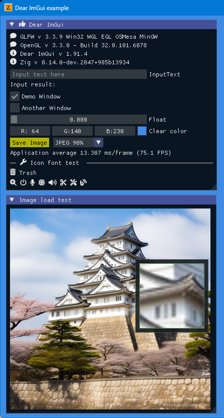
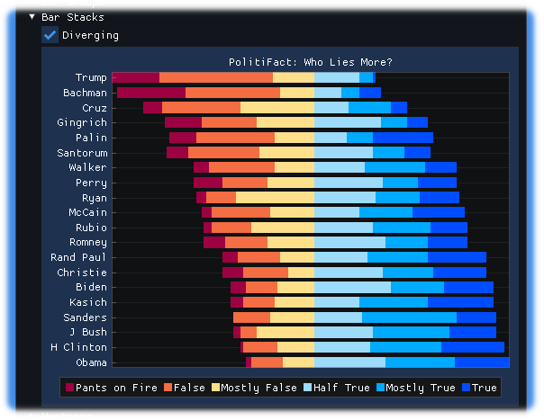

<!-- START doctoc generated TOC please keep comment here to allow auto update -->
<!-- DON'T EDIT THIS SECTION, INSTEAD RE-RUN doctoc TO UPDATE -->

- [ImGuinZ](#imguinz)
  - [Prerequisites](#prerequisites)
  - [Build and run](#build-and-run)
  - [Examples screen shots](#examples-screen-shots)
    - [glfw_opengl3 / sdl2_opengl3 / sdl3_opengl3](#glfw_opengl3--sdl2_opengl3--sdl3_opengl3)
    - [glfw_opengl3_jp](#glfw_opengl3_jp)
    - [glfw_opengl3_image_load](#glfw_opengl3_image_load)
    - [glfw_opengl3_implot](#glfw_opengl3_implot)
  - [ImPlot Demo written in Zig lang.](#implot-demo-written-in-zig-lang)
    - [Build and run](#build-and-run-1)
    - [ImPlot demo source in Zig lang.](#implot-demo-source-in-zig-lang)
    - [Plots Tab](#plots-tab)
      - [LinePlots (Dynamic)](#lineplots-dynamic)
      - [BarGroups](#bargroups)
      - [BarStacks](#barstacks)
      - [PieCharts](#piecharts)
      - [Heatmaps](#heatmaps)
      - [Histogram2D](#histogram2d)
      - [Images](#images)
    - [Axes Tab](#axes-tab)
      - [LogScale](#logscale)
    - [Subplots Tab](#subplots-tab)
      - [Tables (Dynamic)](#tables-dynamic)
    - [Tools Tab](#tools-tab)
      - [DragRects](#dragrects)
  - [Show / Hide console window](#show--hide-console-window)
  - [SDL libraries](#sdl-libraries)
  - [My tools version](#my-tools-version)
  - [Similar project](#similar-project)
  - [Star History](#star-history)

<!-- END doctoc generated TOC please keep comment here to allow auto update -->

# ImGuinZ 

This project aims to simply and easily build [Dear ImGui](https://github.com/ocornut/imgui) 
[(CImGui)](https://github.com/cimgui/cimgui) / [ImPlot](https://github.com/epezent/implot) [(CImPlot)](https://github.com/cimgui/cimplot) 
examples in Zig language with less external dependencies.

ImGui/CimGui version **1.91.0dock** (2024/08)

- Features 
   - Included [Font Awesome](https://fontawesome.com/search?m=free&o=r) Icon fonts.  
      
   - Included GLFW 3.3.9 static library
   - Included SDL2/SDL3 libraries
   - Inlcuded STB libraries (only stb_image)
   - Available [ImPlot](https://github.com/epezent/implot) [(CImPlot)](https://github.com/cimgui/cimplot) with `ImDrawIdx="unsigned int"`
   - Enabled Input method \(IME\) flag with `IMGUI_ENABLE_WIN32_DEFAULT_IME_FUNCTIONS`


## Prerequisites

---

- Windows10 OS or later
- Now using [zig-windows-x86_64-0.14.0-dev.1569+b56a667ec.zip](https://ziglang.org/builds/zig-windows-x86_64-0.14.0-dev.1569+b56a667ec.zip)  
Probably [zig-windows-x86_64-0.14.0-dev.xxxx+yyyy...](https://ziglang.org/download/) might be ok. (-:) 
- MSys2/MinGW basic commands (make, rm, cp, strip ...)

## Build and run

---

1. Download this project.

   ```sh
   git clone --recurse-submodules https://github.com/dinau/imguinz
   ```
1. Go to one of the examples folder,

   ```sh
   cd imguinz/examples/glfw_opengl3
   ```

1. Build and Run 

   ```sh
   make run                
   ```

   or 

   ```sh
   zig build --release=fast run
   ```

## Examples screen shots 

### glfw_opengl3 / sdl2_opengl3 / sdl3_opengl3

---

[glfw_opengl3](examples/glfw_opengl3/src/main.zig) / 
[sdl2_opengl3](examples/sdl2_opengl3/src/main.zig) / 
[sdl3_opengl3](examples/sdl3_opengl3/src/main.zig)


### glfw_opengl3_jp

---

[glfw_opengl3_jp](examples/glfw_opengl3_jp/src/main.zig)


### glfw_opengl3_image_load

---

[glfw_opengl3_image_load](examples/glfw_opengl3_image_load/src/main.zig)

  
Image file captured would be saved in the folder `./zig-out/bin`.  
Image can be saved as `JPEG / PNG / BMP / TGA` file.

### glfw_opengl3_implot

---

[glfw_opengl3_implot](examples/glfw_opengl3_implot/src/main.zig)


## ImPlot Demo written in Zig lang.

---

Now work in progress.


### Build and run

```sh
pwd
examples/imPlotDemo
make run   # or zig build --release=fast run
```

### ImPlot demo source in Zig lang.

---

[demoAll.zig](examples/imPlotDemo/src/demoAll.zig)

### Plots Tab

---

#### LinePlots (Dynamic)


#### BarGroups


#### BarStacks



#### PieCharts


#### Heatmaps


#### Histogram2D


#### Images


### Axes Tab

---

#### LogScale


### Subplots Tab

---

#### Tables (Dynamic)


### Tools Tab

---

#### DragRects 


## Show / Hide console window

---

Open `build.zig` in each example folder and   
Hide console window: Default,  
Show console window: Commet out this line as follows,

  ```zig
  ... snip ...
  //exe.subsystem = .Windows;  // Hide console window
  ... snip ...
  ```

  and rebuild example.

## SDL libraries

---

- SDL3  Build-SDL3  
https://github.com/mmozeiko/build-sdl3/releases  
https://github.com/mmozeiko/build-sdl3
- SDL3 Build-SDL3-Win32  
https://github.com/JBetz/build-sdl3-win32/releases  
https://github.com/JBetz/build-sdl3-win32

## My tools version

---

- Git version 2.45.2.windows.1
- Make: GNU Make 4.4.1
- Zig: 0.14.0.dev... (zig cc: clang version 18.1.8)
- SDL2 ver.2.30.3
- SDL3 2024-08-04

## Similar project

---

| Language             | Project                                                                                                                                         |
| -------------------: | :----------------------------------------------------------------:                                                                              |
| **Nim**              | [ImGuin](https://github.com/dinau/imguin), [Nimgl_test](https://github.com/dinau/nimgl_test), [Nim_implot](https://github.com/dinau/nim_implot) |
| **Lua**              | [LuaJITImGui](https://github.com/dinau/luajitimgui)                                                                                             |
| **Python**           | [DearPyGui for 32bit WindowsOS Binary](https://github.com/dinau/DearPyGui32/tree/win32)                                                         |
| **Zig**, C lang.     | [Dear_Bindings_Build](https://github.com/dinau/dear_bindings_build)                                                                             |
| **Zig**              | [ImGuinZ](https://github.com/dinau/imguinz)                                                                                         |

## Star History

[](https://star-history.com/#dinau/imguinz&Date)
